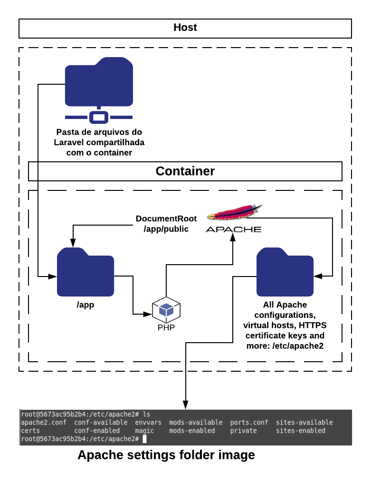

# Projeto de IOC (Insfraestrutura orientada a código)

    

Neste repositorio contém todas as configurações necessárias, para criar
uma imagem do Docker, para rodar uma aplicação laravel, e realizar o deploy
da mesma de forma automatizada.

# Como subir o container para rodar a aplicação do laravel ?

## Atenção:

O arquivo <b>docker-compose.yml</b> é o arquivo de configuração de produção, nele, nem vem por padrão a configuração de um banco de dados, só vem a configuração da aplicação PHP mesmo. Para realizar testes locais siga os passos abaixo, porém, em ver de rodar o arquivo <b>docker-compose.yml</b>, rode o arquivo <b>docker-compose-with-mysql.yml</b>, que já vem inclusive com as configurações de banco de dados para facilitar os testes.

É preciso lembrar que na configuração do arquivo <b>docker-compose-with-mysql.yml</b> o banco de dados do MySQL por padrão aponta para escutar conexões na porta 3306, se você já tive uma instalação do MySQL instalado em sua máquina, sugiro desinstala-lo, ou desabilita-lo.

## Configurações principais

1. É preciso existir uma pasta no caminho <strong>/home/oportuni/public_html</strong>, onde todo o projeto <strong>laravel</strong> precisa estar dentro.

2. Na pasta <strong>/home/oportuni/public_html</strong> crie o arquivo <strong>.env</strong> com todas as informações necessárias, antes de rodar o container, inclusive credenciais de banco de dados.

3. Caso queira que o projeto tenha <strong>HTTPS</strong>, a chave publica precisa estar dentro da pasta <strong>/etc/pki/tls/certs</strong>, e a chave privada precisa estar dentro da pasta <strong>/etc/pki/tls/private</strong>.

4. Certifique-se de ter o <strong>docker</strong>, e o <strong>docker-compose</strong> instalados em sua máquina.

5. Para iniciar o projeto, é preciso ter uma rede chamada <strong>rede_docker</strong> pré-existente, caso não tenha, basta rodar o script <strong>script-create-rede-docker.sh</strong> no terminal.

6. Depois de verificar, e ou seguir todos os passos acima, para roda o container, basta ir na pasta raiz do projeto do <strong>docker</strong> e iniciar o container da seguinte forma: <strong>docker-compose up -d</strong>.

# Arquitetura do container.

Foi utilizada a imagem oficial do PHP que é a php:7.2-apache(https://hub.docker.com/_/php), como base, para criar a imagem do *laravel-oportunidades*. O container recebe conexões nas portas 80 e 443, sendo que na 443 ele recebe conexões via HTTPS. Como o Laravel tem a funcionalidade de migrations, que facilita a migração, e o uso de qualquer banco de dados relacional, seja ele MySQL ou PostegreSQL, resolvi não representar qual banco de dados a aplicação irá utilizar na imagem. Veja na Figura logo abaixo a arquitetura do container que será utilizado:

    

# Arquitetura de pastas do container.

O computador (Host), onde estará o container, precisará ter uma pasta, onde ficará todos os arquivos da aplicação do Laravel, esta pasta será compartilhada com o container, e o mesmo irá gerencia-lá. Isso facilita a atualização da aplicação que ter a necessidade de entrar dentro do container.

Por padrão o <b>DocumentRoot</b> do apache aponta para a pasta <b>/app/public</b> do container, que é a para onde fica o arquivo <b>index.php</b>, que é onde é processado as requisições.

Também é possível ver imagem abaixo a pasta onde fica todas as configurações do apache, caso você queira alterar algura configuração ou substituir um arquivo usando o espelhamento de pasta do docker-composer.yml, as pasta e configuração são o mais perto do padrão, como é possível ver na imagem, com a listagem de pastas do Apache.

    

