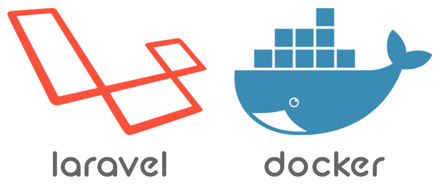
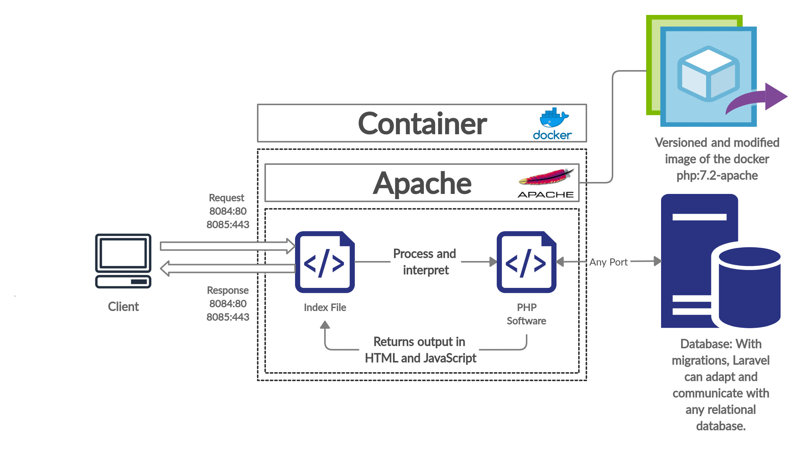

# Projeto de IOC (Insfraestrutura orientada a código)

    

Neste repositorio contém todas as configurações necessárias, para criar
uma imagem do Docker, para rodar uma aplicação laravel, e realizar o deploy
da mesma de forma automatizada.

# Como subir o container para rodar a aplicação do laravel ?

## Configurações principais

1. É preciso existir uma pasta no caminho <strong>/home/oportuni/public_html</strong>, onde todo o projeto <strong>laravel</strong> precisa estar dentro.

2. Na pasta <strong>/home/oportuni/public_html</strong> crie o arquivo <strong>.env</strong> com todas as informações necessárias, antes de rodar o container, inclusive credenciais de banco de dados.

3. Caso queira que o projeto tenha <strong>HTTPS</strong>, a chave publica precisa estar dentro da pasta <strong>/etc/pki/tls/certs</strong>, e a chave privada precisa estar dentro da pasta <strong>/etc/pki/tls/private</strong>.

4. Certifique-se de ter o <strong>docker</strong>, e o <strong>docker-compose</strong> instalados em sua máquina.

5. Para iniciar o projeto, é preciso ter uma rede chamada <strong>rede_docker</strong> pré-existente, caso não tenha, basta rodar o script <strong>script-create-rede-docker.sh</strong> no terminal.

6. Depois de verificar, e ou seguir todos os passos acima, para roda o container, basta ir na pasta raiz do projeto do <strong>docker</strong> e iniciar o container da seguinte forma: <strong>docker-compose up -d</strong>.

# Arquitetura do container.

Foi utilizada a imagem oficial do PHP que é a [*php:7.2-apache*](https://hub.docker.com/_/php), como base, para criar a imagem do *laravel-oportunidades*. O container recebe conexões nas portas 80 e 443, sendo que na 443 ele recebe conexões via HTTPS. Como o Laravel tem a funcionalidade de migrations, que facilita a migração, e o uso de qualquer banco de dados relacional, seja ele MySQL ou PostegreSQL, resolvi não representar qual banco de dados a aplicação irá utilizar na imagem. Veja na Figura logo abaixo a arquitetura do container que será utilizado:

    

